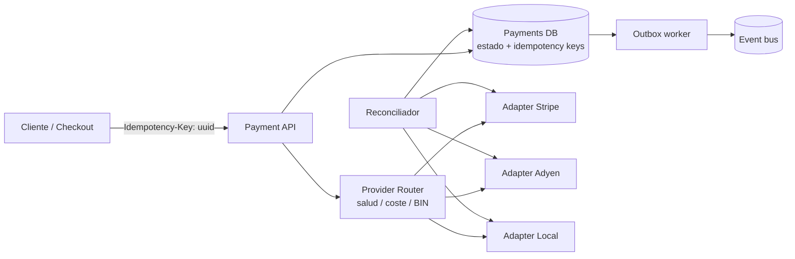
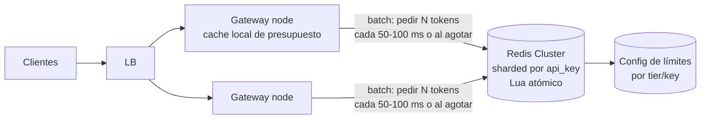
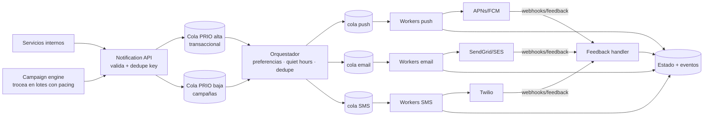
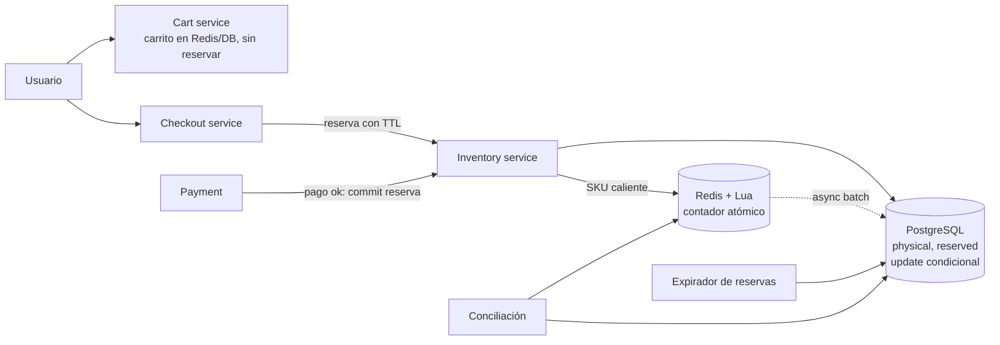
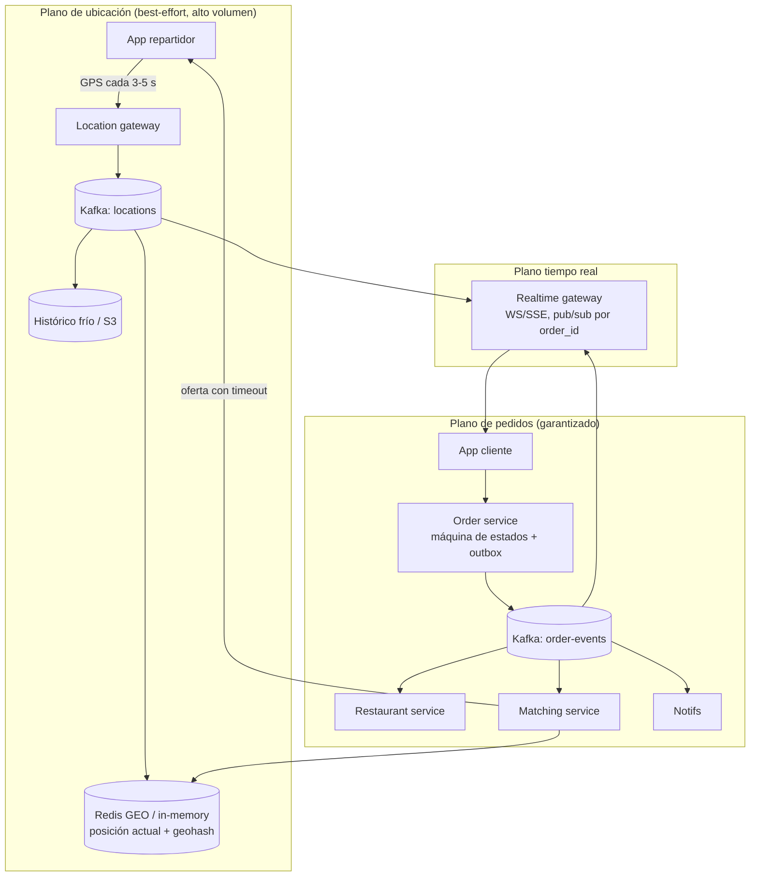
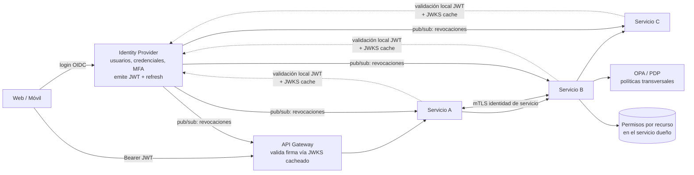
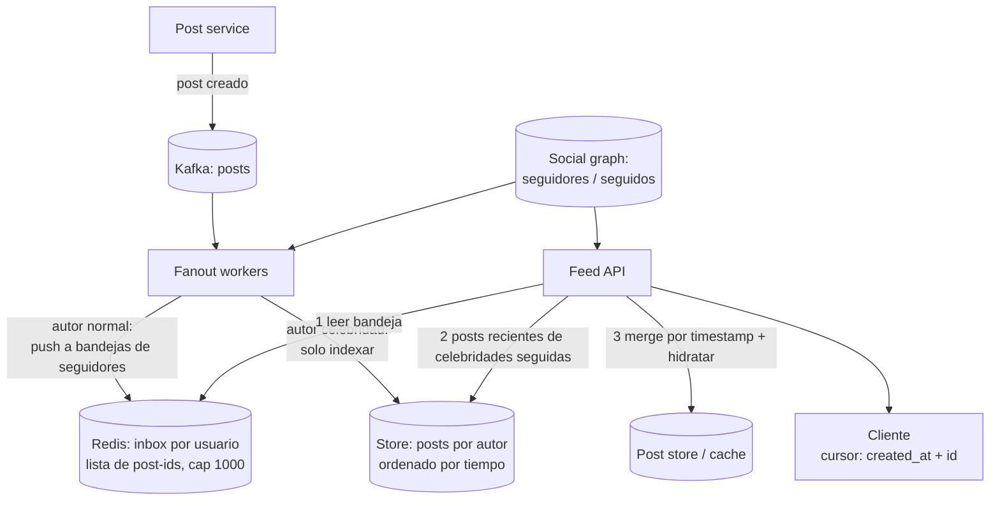
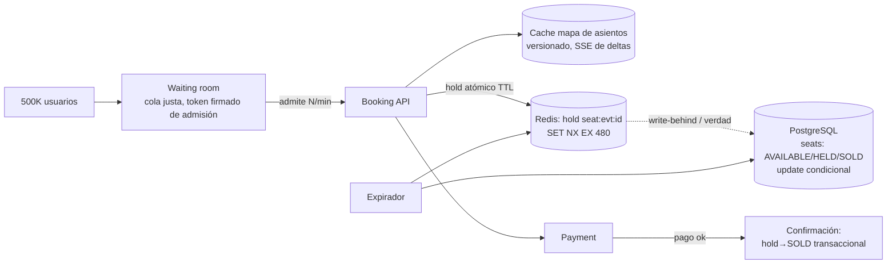
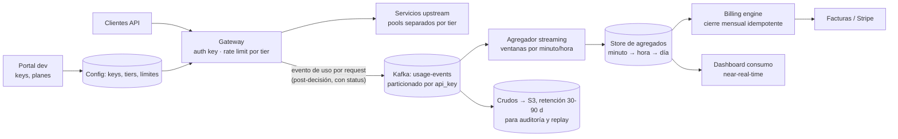

# Casos de estudio: System Design (nivel senior)

Casos de diseño de sistemas tal como se plantean en entrevistas senior/staff. Cada caso incluye el enunciado del entrevistador, una respuesta resumen y una respuesta detallada con proceso de razonamiento explícito.

---

## 1. Sistema de pagos idempotente multi-proveedor
**Categoría:** Pagos / Consistencia · **Tipo:** [CASO] System Design

### 🎯 Enunciado
"Diseña el servicio de pagos de un e-commerce que procesa 2M de transacciones/día. Debe integrar varios proveedores (Stripe, Adyen, un adquirente local) con failover entre ellos, garantizar que **nunca se cobra dos veces** aunque el cliente reintente, la red falle o un proveedor responda con timeout, y soportar reembolsos parciales. Presupuesto de disponibilidad: 99.95%."

### 📝 Respuesta resumen
Servicio de pagos con **idempotency keys de extremo a extremo** (generadas en el cliente, persistidas antes de tocar al proveedor), una **máquina de estados por pago** (`CREATED → AUTHORIZING → AUTHORIZED/FAILED → CAPTURED → REFUNDED`) almacenada en una BD transaccional, y una capa de **abstracción de proveedores** con enrutamiento por salud/coste y failover. Los timeouts hacia el proveedor se tratan como **estado desconocido**: nunca se reintenta a ciegas, se consulta el estado (reconciliación) antes de reenviar. Eventos salientes vía **transactional outbox**. Conciliación diaria contra los reportes del proveedor cierra el ciclo.

### 📖 Respuesta detallada

**Aclaración de requisitos (preguntas que haría):**
- ¿Flujo de un paso (charge) o dos pasos (authorize + capture)? Asumo dos pasos: es lo habitual en e-commerce (autorizas al hacer checkout, capturas al enviar).
- ¿El failover entre proveedores es por transacción (retry en otro proveedor) o por enrutamiento (elegir proveedor antes de intentar)? Ambos, con reglas.
- ¿Qué pasa si el proveedor confirma pero nosotros nos caemos antes de persistir? Esto define el diseño: necesitamos poder recuperar estado desde el proveedor.
- ¿Moneda única o multi-moneda? ¿PCI-DSS en scope? Asumo tokenización (nunca guardamos PAN); el token puede ser por proveedor, lo que complica el failover.

**Estimaciones:** 2M tx/día ≈ 23 TPS medio, pico ×10 ≈ 230 TPS. Cada pago genera ~5-10 filas (intentos, eventos, ledger): ~20M filas/día, unos pocos KB por tx → ~10-20 GB/día con eventos. Una sola instancia de PostgreSQL bien dimensionada aguanta la escritura; el diseño se justifica por **corrección**, no por throughput.

**Arquitectura propuesta:**



**Idempotencia end-to-end (el corazón del diseño):**
1. El **cliente genera la idempotency key** (UUID por intento de compra, no por click). Si el usuario pulsa dos veces o la app reintenta por timeout, llega la misma key.
2. El API hace `INSERT ... ON CONFLICT DO NOTHING` de la key **en la misma transacción** que crea el pago en estado `CREATED`. Si la key ya existe, devuelve el resultado almacenado (o `409/en curso` si aún está procesándose). Esto convierte el "exactly-once" imposible en "at-least-once + deduplicación", que sí es implementable.
3. Hacia el proveedor propagamos **nuestra propia idempotency key** (Stripe y Adyen la soportan). Así un reintento de red hacia el proveedor tampoco duplica.
4. **Timeout del proveedor = estado desconocido.** El pago queda en `AUTHORIZING`; un worker consulta `GET /payment_intents/{id}` antes de decidir. Reintentar a ciegas tras un timeout es la causa nº1 de dobles cobros.

**Máquina de estados y persistencia:** cada transición es un `UPDATE ... WHERE estado = X` (optimistic locking). Transiciones ilegales fallan ruidosamente. Guardo cada intento contra cada proveedor como fila propia (`payment_attempts`), lo que da trazabilidad para el failover y la conciliación. Un **ledger append-only** de doble entrada registra los movimientos: el estado se puede reconstruir, el dinero nunca se "edita".

**Multi-proveedor y failover:** el router decide por salud (circuit breaker por proveedor con métricas de éxito/latencia), coste por BIN/país y reglas de negocio. Regla crítica de failover: **solo se reintenta en otro proveedor si el primero devolvió un fallo definitivo** (`declined`, `4xx`). Con timeout/estado desconocido, primero se resuelve el estado con el proveedor A; si quedó autorizado, se cancela (void) antes de intentar con B. El trade-off del failover con tokenización: si el token de tarjeta es de Stripe, no sirve en Adyen → o usamos network tokens / un vault propio (más scope PCI), o el failover solo aplica a métodos de pago portables.

**Decisiones y trade-offs:**
- **SQL transaccional vs NoSQL:** elegido SQL. Necesito transacciones multi-fila (key + pago + outbox) y el throughput es bajo. DynamoDB obligaría a transacciones distribuidas o a colapsar todo en un ítem.
- **Outbox vs publicar directo al bus:** outbox. Publicar tras el commit puede perder eventos (commit ok, publish falla) o duplicarlos sin orden; el outbox da atomicidad con el estado.
- **Orquestación síncrona vs asíncrona:** la autorización es síncrona (el usuario espera), captura y refund son asíncronos con reintentos.

**Cuellos de botella y evolución:** la tabla de idempotency keys crece sin límite → TTL (p. ej. 7 días) + particionado por fecha. Si el volumen ×50, shardear por `merchant_id` o `payment_id` hash; el ledger se archiva a almacenamiento frío. La conciliación diaria (reportes de settlement del proveedor vs ledger) es el mecanismo que detecta lo que todo lo demás dejó escapar.

**Qué espera oír el entrevistador:** que los timeouts son estado desconocido y no error; idempotency key persistida atómicamente con el pago; máquina de estados con transiciones guardadas; outbox; que el failover no puede ser un simple retry; conciliación como red de seguridad; y la complicación real de tokens por proveedor.

---

## 2. Rate limiter distribuido
**Categoría:** Infraestructura / Tráfico · **Tipo:** [CASO] System Design

### 🎯 Enunciado
"Diseña un rate limiter para nuestra plataforma de APIs: 500K req/s agregadas, límites por API key (p. ej. 1.000 req/min), múltiples datacenters, y debe añadir menos de 2 ms de latencia p99. Un cliente no debe poder superar su límite de forma significativa aunque golpee varios nodos a la vez. ¿Dónde lo colocas, qué algoritmo usas y cómo lo haces tolerante a fallos?"

### 📝 Respuesta resumen
Rate limiter en el **API gateway** con contadores centralizados en **Redis (cluster, sharded por key)** y algoritmo **sliding window counter** (o token bucket) ejecutado como **script Lua atómico**. Para cumplir p99 < 2 ms a 500K req/s, los nodos del gateway usan un **caché local con presupuesto** (le piden a Redis "lotes" de tokens y descuentan en memoria), aceptando una sobre-admisión acotada. Ante fallo de Redis: **fail-open con límite local conservador**, nunca fail-closed. Entre regiones, límites particionados por región o sincronización asíncrona, aceptando error temporal.

### 📖 Respuesta detallada

**Aclaración de requisitos:**
- ¿El límite debe ser exacto o aproximado? Es la pregunta que cambia todo el diseño. Para protección de infraestructura, ±5% es aceptable; para facturación estricta, no.
- ¿Límite global entre datacenters o por región? ¿Qué devolvemos al cliente (429 + `Retry-After`, headers de cuota)?
- ¿Debe soportar ráfagas (burst) por encima del límite sostenido? Token bucket lo modela naturalmente.
- ¿Cuántas API keys activas? Asumo ~1M keys → el estado total es pequeño (decenas de MB), el problema es el **throughput de acceso**, no el almacenamiento.

**Estimaciones:** 500K req/s; si cada request hiciera un round-trip a Redis, necesitaríamos ~500K ops/s en Redis (un cluster lo aguanta: ~100K ops/s por shard × 5-10 shards), pero el round-trip (0.5-1 ms en el mejor caso, más bajo carga) se come el presupuesto de 2 ms p99. Conclusión de la estimación: **no puede haber un viaje a Redis por request** → hace falta batching o caché local.

**Elección de algoritmo (razonamiento explícito):**
- *Fixed window:* barato pero permite hasta 2× el límite en el borde de ventana. Descartado.
- *Sliding window log:* exacto pero O(n) memoria por key (guarda timestamps). Caro a este volumen. Descartado.
- *Sliding window counter:* interpola ventana actual y anterior; error < 1-2%, O(1) memoria. Elegido para límites por minuto.
- *Token bucket:* O(1), modela bursts con `capacity` y `refill_rate`. Elegido si el producto quiere permitir ráfagas.
Ambos se implementan como script Lua en Redis: leer-calcular-escribir en una sola operación atómica, sin race conditions entre nodos del gateway.

**Arquitectura:**



**El truco de la latencia — presupuesto local:** cada nodo del gateway mantiene por key un mini-bucket local. Pide a Redis un lote (p. ej. 50 tokens o el 1/N proporcional del límite) y admite requests descontando en memoria (~ns). Cuando el lote se agota o expira, pide otro. Trade-off explícito: un cliente que golpea 20 nodos puede exceder su límite transitoriamente hasta en un lote × nodos; con lotes pequeños el error se acota a un pequeño %. Esto es **eventual consistency aplicada a contadores**, y es la única forma de cumplir 2 ms p99 a este volumen. Si el entrevistador exige exactitud estricta, la respuesta correcta es: "entonces el p99 sube, elige".

**Tolerancia a fallos (decisión de diseño, no un detalle):**
- Redis caído o lento (timeout de 5-10 ms): **fail-open** con un límite local conservador por nodo (límite_global / nº nodos estimado). Un rate limiter cuya caída tumba el 100% del tráfico es peor que el problema que resuelve.
- Redis Cluster con réplicas y sharding por `hash(api_key)` → la pérdida de un shard afecta a 1/N de las keys, y solo degrada a límite local.
- Hot key (una API key con tráfico masivo): dividir su contador en sub-keys (`key:0..k`) y sumar, o asignarle presupuesto local mayor.

**Multi-datacenter:** sincronizar contadores globalmente en línea es inviable (RTT entre regiones > presupuesto de latencia). Opciones: (a) particionar el límite por región según distribución histórica del cliente (simple, error acotado), (b) contadores locales + agregación asíncrona con corrección (CRDT-like). Elijo (a) por simplicidad operativa, documentando que el límite es "por región efectiva".

**Cuellos de botella y evolución:** el config de límites se cachea en el gateway con TTL corto + invalidación por pub/sub. Añadir tiers y overrides por endpoint es un lookup más, no un rediseño. Métricas clave: ratio de 429, error de sobre-admisión real vs límite, latencia añadida p99.

**Qué espera oír el entrevistador:** comparación razonada de algoritmos (no solo nombrarlos); atomicidad vía Lua; darse cuenta de que el round-trip a Redis rompe el presupuesto de latencia y proponer batching/caché local con su trade-off de exactitud; fail-open razonado; estrategia multi-región consciente de que la exactitud global en línea es imposible; manejo de hot keys.

---

## 3. Sistema de notificaciones (push/email/SMS) a 50M usuarios
**Categoría:** Mensajería / Fan-out · **Tipo:** [CASO] System Design

### 🎯 Enunciado
"Diseña la plataforma de notificaciones de una app con 50M de usuarios: push, email y SMS. Debe soportar notificaciones transaccionales (OTP, 'tu pedido llegó') con latencia de segundos y campañas masivas a decenas de millones de usuarios sin que unas bloqueen a las otras. Requisitos: no molestar (preferencias, quiet hours, dedupe), no perder notificaciones críticas, y tolerar que los proveedores (APNs, SendGrid, Twilio) fallen o limiten el rate."

### 📝 Respuesta resumen
Plataforma con **API de ingesta única** que valida y encola; **colas separadas por prioridad y por canal** (transaccional ≠ campañas, push ≠ SMS) para aislar cargas; workers por canal que aplican **preferencias, rate limiting por proveedor y por usuario, plantillas y dedupe** antes de llamar a proveedores intercambiables. Campañas masivas se trocean en lotes que se inyectan a un ritmo controlado (el fan-out de 50M es un problema de *pacing*, no de velocidad bruta). Entrega **at-least-once + idempotencia** en el envío; DLQ y tracking de estado por notificación; feedback de proveedores (bounces, tokens inválidos) realimenta la base de contactos.

### 📖 Respuesta detallada

**Aclaración de requisitos:**
- ¿Qué garantía por tipo? OTP: segundos y crítico. Campaña: puede tardar horas, pero no debe duplicarse. "Pedido llegó": minutos.
- ¿Multi-dispositivo (varios tokens push por usuario)? ¿Fallback entre canales (si el push no se entrega, email)?
- ¿Quién define el contenido: el servicio emisor manda texto final o template_id + variables? Elijo plantillas centralizadas (i18n, consistencia, auditoría).
- ¿Límites de proveedores? Twilio/SendGrid imponen rate limits reales; APNs tolera mucho más.

**Estimaciones:** campaña a 50M usuarios en 1 h → ~14K notificaciones/s sostenidas; transaccionales quizá 500-2K/s. Estado por notificación (~1 KB con eventos de tracking) → una campaña grande genera ~50 GB de registros; retención 30-90 días → almacenamiento apreciable, mejor en una tabla particionada por fecha o un store columnar para analítica. El cálculo clave: 50M por SMS a ~100 msg/s de un número corto tardaría días → SMS masivo exige acuerdos de throughput o descartarse para campañas.

**Arquitectura:**



**Decisiones y trade-offs:**
- **Colas separadas por prioridad, no una cola con campo "prioridad":** la mayoría de brokers (Kafka, SQS) no reordenan por prioridad; si las campañas comparten cola con los OTP, una campaña de 50M mete horas de cola delante de un OTP. El aislamiento físico de colas es la decisión más importante del diseño. Workers de transaccional tienen capacidad reservada (bulkhead).
- **At-least-once + idempotencia, no exactly-once:** el broker puede reentregar. Cada notificación lleva `dedupe_key` (p. ej. `user_id + evento + ventana`); el worker consulta/registra en Redis o en la tabla de estado antes de llamar al proveedor. Duplicar un OTP es molesto; duplicar 50M emails es un incidente.
- **Pacing de campañas en el productor, no en el consumidor:** el campaign engine lee el segmento (de un snapshot, no de la BD de usuarios en vivo), trocea en lotes de ~10K y los inyecta al ritmo que los proveedores y nuestra infraestructura toleran. Alternativa descartada: volcar 50M mensajes de golpe y confiar en que los workers "aguanten" — provoca picos en BD de preferencias, en Redis y en los proveedores.
- **Rate limiting en dos niveles:** por proveedor (token bucket global, p. ej. 100/s hacia Twilio) y por usuario (máx. N notificaciones/día, colapsado de similares). El primero protege contratos; el segundo protege el producto.
- **Proveedores intercambiables tras una interfaz:** circuit breaker por proveedor y failover (SES↔SendGrid). Para push no hay failover posible (APNs/FCM son monopolio del canal): solo reintentos con backoff y, opcionalmente, fallback de canal.

**Manejo de fallos:** reintentos con backoff exponencial + jitter por notificación; tras N intentos → DLQ con motivo; los OTP no se reintentan más allá de su TTL (un OTP entregado tarde es peor que no entregado, expira y el usuario pide otro). Feedback loops: tokens push inválidos y hard bounces marcan el contacto y evitan reenvíos (crítico para reputación de dominio de email).

**Cuellos de botella y evolución:** la consulta de preferencias a 14K/s → caché con invalidación por evento; el estado de tracking es la mayor carga de escritura → escrituras en batch/async, tabla particionada. Evolución natural: motor de "journeys" (secuencias con esperas y condiciones) encima del mismo pipeline, y agregación de métricas de engagement por campaña.

**Qué espera oír el entrevistador:** aislamiento transaccional/campañas como decisión central; pacing del fan-out; dedupe explícito con su clave; rate limits de proveedores como restricción de primer orden (con el cálculo de SMS); feedback loops de bounces/tokens; DLQ y política de reintentos distinta por tipo de notificación.

---
## 4. Carrito de compras con inventario en tiempo real (overselling)
**Categoría:** E-commerce / Concurrencia · **Tipo:** [CASO] System Design

### 🎯 Enunciado
"Nuestro e-commerce vende productos con stock limitado y hacemos drops de productos muy demandados: 100K usuarios intentando comprar 500 unidades en el primer minuto. Diseña el carrito y el control de inventario para que **no vendamos más stock del que hay**, sin matar la conversión (no queremos bloquear stock de gente que abandona el carrito) y sin que la BD de inventario se derrita bajo la contención."

### 📝 Respuesta resumen
Separar **stock físico** (verdad contable) de **stock disponible** (`disponible = físico − reservado`). Añadir al carrito **no reserva** (o reserva blanda con TTL corto solo en drops); la reserva dura ocurre **al iniciar el checkout**, con expiración (10-15 min) que devuelve stock automáticamente. El decremento es atómico: `UPDATE inventory SET reserved = reserved + 1 WHERE sku = ? AND (physical - reserved) >= 1` — la condición en el WHERE es la barrera contra overselling. Para drops de alta contención, la reserva se mueve a **Redis con Lua** (o a una cola que serializa el SKU caliente), y la BD se actualiza asíncronamente. La conciliación periódica repara divergencias.

### 📖 Respuesta detallada

**Aclaración de requisitos:**
- ¿Cuándo se "compromete" el stock: al añadir al carrito, al iniciar checkout o al pagar? Es la decisión de producto que determina el diseño técnico. Reservar al añadir al carrito con abandono del ~70% mata la disponibilidad; reservar solo al pagar produce "pagué y no había stock". Punto medio: reservar al **iniciar checkout** con TTL.
- ¿Es aceptable un oversell ocasional que se resuelve con disculpa/reembolso? Para retail normal quizá; para entradas de un concierto, no. Asumo tolerancia cero.
- ¿Multi-almacén? ¿Ventas omnicanal (tienda física decrementa el mismo stock)? Asumo un pool lógico por SKU.

**Estimaciones:** catálogo 1M SKUs → tabla de inventario pequeña (~GB). Tráfico normal: cientos de TPS repartidos → sin contención. El problema es el **drop**: 100K compradores / 500 unidades / 60 s → miles de intentos de reserva/s **sobre una sola fila**. Una fila caliente en PostgreSQL soporta quizá 1-5K updates serializados/s con lock contention creciente: estamos justo en la zona de peligro. El diseño general (BD) sirve para el 99% del catálogo; el SKU caliente necesita un camino especial.

**Arquitectura:**



**El mecanismo anti-overselling (razonamiento):** la única barrera fiable es una **operación atómica condicional** en el punto de verdad:
```sql
UPDATE inventory SET reserved = reserved + :qty
WHERE sku = :sku AND physical - reserved >= :qty;
-- affected_rows = 0 → "sin stock", sin race condition posible
```
Leer-decidir-escribir en dos pasos (SELECT y luego UPDATE) siempre tiene race salvo con `SELECT FOR UPDATE`, que serializa igual pero con más locks. Descarto también el optimistic locking con versión para el SKU caliente: con miles de contendientes, el retry-rate explota (casi todos pierden la carrera y reintentan).

**Ciclo de vida de la reserva:** `reserva(TTL 10-15 min) → pago ok → commit (physical−1, reserved−1)` o `TTL vence / usuario abandona → release (reserved−1)`. El expirador es un job que libera reservas vencidas; las reservas llevan `expires_at` y el commit valida que la reserva siga viva. Esto responde al requisito de "no bloquear stock de abandonos": el stock vuelve solo.

**El SKU caliente (drop):** dos opciones y su trade-off:
1. **Redis + Lua:** contador `stock:sku` decrementado atómicamente en Lua (revisa y decrementa en una operación). Latencia µs, aguanta cientos de miles de ops/s. Riesgo: Redis es menos durable — mitigado con AOF y con conciliación contra la BD; el peor caso realista es *undersell* transitorio, no oversell, si sembramos Redis con el stock exacto.
2. **Serialización por cola:** las peticiones del SKU entran a una partición de Kafka por SKU y un único consumidor las procesa en orden. Correctísimo y auditable, pero añade latencia y complejidad de UX (respuesta asíncrona: "estás en cola").
Elijo Redis+Lua para el caso general de drops y menciono la cola como alternativa cuando se exige auditabilidad estricta (ticketing). Complemento de UX honesto: para 100K personas y 500 unidades, una **waiting room** delante del checkout resuelve más que cualquier optimización de BD — el 99.5% va a fallar; mejor decírselo pronto y proteger el sistema.

**Decisiones y trade-offs adicionales:**
- Carrito en Redis (hash por usuario, TTL días) — es estado efímero y tolerable de perder; no contamina la BD transaccional.
- El inventario **no** se decrementa desde el carrito ni desde eventos de UI: solo checkout/pago hablan con inventory. Menos superficies, menos bugs.
- Mostrar "quedan 3" es una **lectura eventual** (caché con TTL de segundos); nunca es la base de la decisión de venta. Distinguir lectura decorativa de escritura autoritativa es clave.

**Cuellos de botella y evolución:** multi-almacén → una fila por (sku, almacén) y un asignador; omnicanal → el POS físico pasa por el mismo inventory service o se le asigna un sub-pool. Si aparecen oversells reales, la conciliación (physical vs suma de reservas y ventas) los detecta y un flujo de compensación (cancelar el último pedido, cupón) los gestiona: el sistema perfecto no existe, el sistema que se auto-detecta sí.

**Qué espera oír el entrevistador:** la pregunta "¿cuándo se reserva?" antes de dibujar nada; update condicional atómico como barrera; reservas con TTL; reconocer la fila caliente como problema distinto y darle un camino especial (Redis/Lua o serialización); waiting room como respuesta de sistema, no solo de BD; conciliación como red final.

---

## 5. Plataforma de pedidos tipo delivery con tracking en tiempo real
**Categoría:** Marketplace / Tiempo real · **Tipo:** [CASO] System Design

### 🎯 Enunciado
"Diseña una plataforma tipo Rappi/Uber Eats para 1M de pedidos/día en 20 ciudades: clientes piden, restaurantes aceptan y preparan, repartidores recogen y entregan. Requisitos: asignación de repartidor cercano en segundos, tracking de la posición del repartidor en tiempo real para el cliente (actualización cada pocos segundos), y estado del pedido consistente entre las tres apps. Los repartidores tienen conectividad móvil intermitente."

### 📝 Respuesta resumen
Tres planos: **plano de pedidos** (máquina de estados del pedido, transaccional, orquestada por eventos), **plano de ubicación** (ingesta masiva de GPS en un pipeline apart: gateway → Kafka → store en memoria con geo-index, nada de escribir GPS en la BD de pedidos) y **plano de tiempo real hacia clientes** (WebSocket/SSE con pub/sub por pedido). El matching consulta el geo-index (repartidores en radio X, filtrados por capacidad/rating) y ofrece el pedido con timeout en cascada. La posición viaja **best-effort** (perder un punto GPS no importa); el estado del pedido viaja **garantizado** (eventos con outbox). Esa separación de garantías es el corazón del diseño.

### 📖 Respuesta detallada

**Aclaración de requisitos:**
- ¿Frecuencia de GPS? Cada 3-5 s en pedido activo es el estándar. ¿Precisión del ETA importa o basta el punto en el mapa? Asumo punto + ETA aproximado.
- ¿Asignación: broadcast a varios repartidores o oferta secuencial? Secuencial con timeout (10-15 s) da mejor experiencia al repartidor; broadcast da menor latencia. Elijo secuencial con fallback a lote.
- ¿Qué pasa si el restaurante no acepta, o el repartidor desaparece a mitad de entrega? Necesito timeouts y reasignación en cada etapa: la máquina de estados debe modelar fallos, no solo el camino feliz.

**Estimaciones:** 1M pedidos/día, pico de comida ~×5 del promedio → ~60-100 pedidos/s en pico. Repartidores activos concurrentes: ~50-100K. GPS: 100K × 1 punto/4 s ≈ **25K escrituras/s de ubicación** — dos órdenes de magnitud más que los pedidos. Conclusión: la ubicación domina la carga y **debe tener su propio pipeline**; mezclarla con la BD de pedidos es el error clásico. Conexiones en tiempo real: cada pedido activo ≈ 1-3 conexiones (cliente, a veces restaurante) → ~200-500K conexiones concurrentes en pico.

**Arquitectura:**



**Máquina de estados del pedido:** `CREATED → PAID → ACCEPTED_BY_RESTAURANT → PREPARING → COURIER_ASSIGNED → PICKED_UP → DELIVERED`, con ramas de fallo (`RESTAURANT_TIMEOUT → cancel/refund`, `COURIER_DROPPED → re-matching`). El order service es el único dueño del estado; restaurantes y matching reaccionan a eventos y proponen transiciones. Cada timeout es un timer persistente (no un `sleep` en memoria): si el servicio se reinicia, los timeouts sobreviven.

**Matching (asignación):** consulta al geo-index los repartidores en radio creciente (1→3→5 km) con geohash/Redis GEO, filtra (capacidad, en turno, tipo de vehículo), rankea por score (distancia + carga + rating) y **ofrece secuencialmente** con timeout. La oferta usa un lock corto sobre el repartidor (Redis `SET NX EX`) para que no reciba dos ofertas a la vez. Trade-off: el matching óptimo global (asignación tipo húngaro por lotes cada N segundos) mejora eficiencia de flota en horas pico; el greedy secuencial es más simple y de menor latencia. Empiezo greedy, evoluciono a lotes en zonas densas.

**Tracking en tiempo real:** el cliente se suscribe por WebSocket al canal de su `order_id`. El realtime gateway consume de Kafka y hace fan-out. Decisiones: (a) **throttle/coalescing** — al cliente le basta 1 update cada 3-5 s, se descartan intermedios (last-write-wins: solo importa la última posición); (b) conectividad intermitente del repartidor → su app bufferea puntos y manda el último al reconectar, el servidor usa el timestamp del dispositivo y descarta out-of-order; (c) al reconectar el cliente, snapshot del estado actual + suscripción (no replay de todo). Suavizado/interpolación en el cliente para que el pin no salte.

**Decisiones y trade-offs:** eventos con outbox para el plano de pedidos (perder un `PICKED_UP` deja el sistema incoherente) vs fire-and-forget para GPS (perder un punto es irrelevante) — asignar garantías por tipo de dato en lugar de "todo garantizado" es lo que hace el sistema viable en coste. Sharding natural **por ciudad/zona geográfica**: matching, geo-index y hasta clusters enteros se particionan por ciudad, lo que además limita el blast radius.

**Cuellos de botella y evolución:** el realtime gateway con cientos de miles de WS es el componente más delicado → stateless con pub/sub compartido (Redis pub/sub o Kafka) y balanceo con sticky por conexión. El ETA evoluciona de heurística (distancia/velocidad media) a modelo con tráfico. El histórico de ubicaciones va a almacenamiento frío para analítica y disputas ("el repartidor sí estuvo en tu puerta").

**Qué espera oír el entrevistador:** separar plano de ubicación (alto volumen, best-effort) del plano de pedidos (bajo volumen, garantizado); estimación que muestra que el GPS domina la carga; máquina de estados con timeouts persistentes y ramas de fallo; matching con ofertas con timeout y lock; coalescing de updates hacia el cliente; sharding por ciudad.

---

## 6. Autenticación y autorización para 100 microservicios
**Categoría:** Seguridad / Plataforma · **Tipo:** [CASO] System Design

### 🎯 Enunciado
"Tenemos 100 microservicios y crecemos. Hoy cada servicio valida credenciales a su manera contra una tabla de usuarios compartida. Diseña la plataforma de identidad: login de usuarios (web + móvil), autorización con roles y permisos por recurso, autenticación **servicio-a-servicio**, revocación de sesiones comprometidas, y que un request que atraviesa 5 servicios no haga 5 llamadas al servicio de auth. Sin vendor lock-in fuerte."

### 📝 Respuesta resumen
**Identity Provider central** (propio sobre OIDC, o Keycloak/equivalente) que emite **access tokens JWT de vida corta (5-15 min)** + refresh tokens rotados y revocables. Los servicios **validan el JWT localmente** (firma con JWKS cacheado) — cero llamadas al IdP en el hot path; ahí se resuelve el requisito de los 5 hops. AuthN de usuarios en el edge (gateway valida y propaga el token); **authZ en dos capas**: roles gruesos en el token, permisos finos por recurso evaluados en el servicio dueño del dato (o PDP tipo OPA para políticas transversales). Servicio-a-servicio con **mTLS (SPIFFE/service mesh)** o client-credentials. Revocación: TTL corto + lista de denegación pequeña propagada por pub/sub para el gap.

### 📖 Respuesta detallada

**Aclaración de requisitos:**
- ¿Qué granularidad de autorización? "Admin puede borrar" (RBAC) vs "el usuario puede editar *este* documento porque es owner" (ReBAC/ABAC). La segunda **no cabe en un token** y define dónde vive la decisión.
- ¿Cuánto puede tardar una revocación en propagarse? ¿Segundos o es aceptable el TTL del token (minutos)? Define todo el mecanismo de revocación.
- ¿Multi-tenant? ¿SSO corporativo (SAML/OIDC federado) para clientes enterprise? Asumo que llegará → el IdP debe federar.
- ¿Presupuesto de latencia del gateway? La validación local de JWT es ~µs; una introspección remota son ms y un SPOF.

**Estimaciones:** 10M usuarios, 1M sesiones activas, 50K req/s agregadas en el edge. Si cada request de cada hop validara contra el IdP: 50K × 3 hops promedio = 150K validaciones/s → el IdP sería el componente más crítico y caro de la empresa. Con JWT validado localmente: 0 req/s al IdP en el hot path; el IdP solo atiende logins (~cientos/s) y refresh (~1M/15 min ≈ 1K/s). Esta estimación **es** el argumento del diseño.

**Arquitectura:**



**AuthN de usuarios:** OIDC estándar (authorization code + PKCE en móvil/SPA). El IdP emite access token JWT (claims: `sub`, `tenant`, roles gruesos, `exp` 5-15 min) y refresh token opaco, rotado en cada uso y con detección de reuso (si un refresh ya rotado se reutiliza → familia de tokens revocada: señal de robo). Sesión web con cookie httpOnly en el BFF si hay web clásica.

**El requisito de los 5 hops:** el token viaja con el request (header) y **cada servicio valida la firma localmente** con las claves públicas del IdP (JWKS, cacheado horas, con rotación de claves soportando 2 claves activas). Trade-off aceptado: un JWT no es revocable hasta su `exp`. Mitigación en dos partes: (1) TTL corto — la ventana de exposición es ≤15 min; (2) para revocación inmediata (logout forzado, cuenta comprometida), el IdP publica el `sub`/`jti` revocado por pub/sub y gateway+servicios mantienen una **denylist en memoria, pequeña porque solo cubre el TTL**. Esto es el punto medio honesto entre "stateless puro" (no revocas) y "introspección siempre" (SPOF + latencia).

**AuthZ en dos capas (la decisión más importante):**
- **Roles/scopes gruesos en el token** (`role: support`, `scope: orders:read`): baratos, se evalúan en el gateway o el servicio, cambian poco.
- **Permisos por recurso** ("¿puede el user 42 editar el pedido 99?"): los evalúa el **servicio dueño del recurso** contra sus propios datos, porque la relación owner/miembro vive ahí. Meter esto en el token no escala (tokens gigantes, staleness) y centralizarlo en un servicio de permisos global (estilo Zanzibar) solo se justifica con permisos compartidos entre muchos servicios — lo menciono como evolución, no como punto de partida.
- Políticas transversales ("nadie fuera de la UE toca datos UE") → PDP tipo OPA con políticas versionadas, evaluado como librería/sidecar (local, sin hop de red).

**Servicio-a-servicio:** identidad de workload con **mTLS vía service mesh (SPIFFE/SPIRE)** — cada servicio tiene certificado propio rotado automáticamente; las policies de "quién puede llamar a quién" viven en el mesh. Alternativa sin mesh: OAuth client-credentials con tokens de servicio. Regla clave: la identidad del **usuario final** se propaga en su JWT original (o un token on-behalf-of), nunca se "eleva" al perfil del servicio llamante — evita el clásico "el servicio interno puede leer todo".

**Cuellos de botella y evolución:** el IdP es tier-0 → multi-AZ, y su BD de usuarios es el dato más sensible (hashing Argon2/bcrypt, detección de credential stuffing). Migración desde el estado actual: primero poner el gateway validando JWT delante de todo, luego migrar servicio a servicio de "leer tabla de usuarios" a "confiar en claims", finalmente cerrar el acceso directo a la tabla.

**Qué espera oír el entrevistador:** validación local de JWT como respuesta a los 5 hops, con la estimación que lo justifica; el trade-off revocación vs stateless resuelto con TTL corto + denylist acotada; authZ dividida en gruesa (token) y fina (servicio dueño); refresh rotation con detección de reuso; mTLS/workload identity para S2S; y plan de migración incremental desde el legacy.

---
## 7. Feed de actividad
**Categoría:** Social / Lectura intensiva · **Tipo:** [CASO] System Design

### 🎯 Enunciado
"Diseña el feed de actividad de una red social/profesional: 20M usuarios activos diarios, cada uno sigue en promedio a 300 cuentas, y existen cuentas con 10M de seguidores. El feed debe cargar en <200 ms, mostrar contenido razonablemente fresco (segundos-minutos), soportar scroll infinito con paginación estable, y sobrevivir a que una celebridad publique en hora pico."

### 📝 Respuesta resumen
Modelo **híbrido push/pull**: para usuarios normales, **fan-out on write** — al publicar, un worker inserta el post-id en las "bandejas" (listas en Redis) de sus seguidores, y leer el feed es un simple range de una lista precomputada (rápido y barato de leer). Para cuentas con >N seguidores (celebridades), **fan-out on read**: no se materializa; en tiempo de lectura se mezclan la bandeja precomputada y los posts recientes de las celebridades seguidas. Paginación por **cursor (timestamp + id)**, nunca offset. Ranking como capa posterior sobre el candidato-set. El híbrido existe porque el push puro muere con celebridades (10M escrituras por post) y el pull puro muere con 300 seguidos por lectura.

### 📖 Respuesta detallada

**Aclaración de requisitos:**
- ¿Feed cronológico o rankeado? Cambia la capa final pero no la infraestructura de candidatos. Asumo cronológico con ranking como evolución.
- ¿Qué es "fresco"? ¿Un post debe aparecer a sus seguidores en <5 s o <5 min? Define el SLA del fan-out.
- ¿Se incluyen señales además de posts (likes de tus contactos, "X comentó en Y")? Asumo posts primero; las señales son más eventos al mismo pipeline.
- ¿Retención del feed? Nadie scrollea más allá de unos cientos de items → la bandeja materializada puede ser corta (500-1000 ids), el resto se resuelve contra el histórico.

**Estimaciones (el argumento del diseño):**
- Lecturas: 20M DAU × 10 cargas/día ≈ 200M lecturas/día ≈ 2.3K/s medio, ~15K/s pico.
- Escrituras: si el 10% publica 1 vez/día → 2M posts/día ≈ 23/s medio.
- **Pull puro:** cada lectura consulta los últimos posts de ~300 seguidos → 15K/s × 300 = 4.5M lookups/s. Inviable sin precomputación.
- **Push puro:** un post de una cuenta de 10M seguidores = 10M inserciones. A 10K inserciones/s son ~17 min de retraso y una avalancha de escritura cada vez que publica. Inviable para celebridades.
- Conclusión numérica: híbrido con umbral (~10-50K seguidores) donde el push deja de compensar. Memoria de bandejas: 20M usuarios activos × 800 ids × ~16 bytes ≈ ~250 GB en Redis (sharded) — caro pero razonable; bandejas solo para usuarios activos (lazy rebuild para inactivos que regresan).

**Arquitectura:**



**Camino de escritura (push):** al publicar, el fan-out worker consulta la lista de seguidores (paginada, del social graph service) y hace `LPUSH + LTRIM` en la bandeja de cada seguidor. Es **asíncrono y at-least-once**: duplicados posibles → la lectura deduplica por post-id (barato). El SLA de frescura del fan-out se monitoriza como lag del consumer group. Optimización: para seguidores inactivos >30 días no se materializa (se reconstruye su bandeja on-demand si vuelven).

**Camino de lectura (merge):** el Feed API lee (1) un rango de la bandeja, (2) para las celebridades que el usuario sigue (lista corta, cacheada), sus posts recientes desde el índice por autor, (3) hace merge por timestamp, deduplica, aplica filtros (bloqueos, borrados) e hidrata los post-ids contra el post store (cache-aside con Redis; los posts de celebridades estarán casi siempre en caché precisamente porque todo el mundo los lee — el hot set se cachea solo).

**Paginación:** cursor `(created_at, post_id)` opaco. Offset se descarta explícitamente: con inserciones constantes, el offset produce items repetidos/saltados al scrollear, y `OFFSET N` es O(N) en el store. El cursor también hace estable el merge híbrido: cada página re-ejecuta el merge "antes de cursor".

**Decisiones y trade-offs:**
- **Bandeja de ids, no de contenido:** las bandejas guardan referencias; el contenido vive una vez en el post store. Fan-out de contenido multiplicaría el almacenamiento ×seguidores y haría imposible editar/borrar.
- **Redis para bandejas vs Cassandra:** Redis da la latencia de lectura (<5 ms) y operaciones de lista naturales; el riesgo de pérdida es aceptable porque la bandeja es **reconstruible** desde el social graph + índice por autor (es una caché materializada, no la fuente de verdad). Con presupuesto ajustado, Cassandra (partition key = user_id, clustering por tiempo) es la alternativa durable.
- **Borrados/edits:** no se persigue cada bandeja para borrar el id (caro); se filtra en lectura contra un set de tombstones + al hidratar (si el post no existe, se omite). Consistencia eventual asumida y explicada.

**Cuellos de botella y evolución:** el social graph (¿quién sigue a quién?) es un servicio caliente → caché agresiva de "seguidos por usuario" (cambia poco). El siguiente paso natural es ranking: el candidato-set (bandeja + celebridades) pasa por un scorer (features precomputadas + modelo ligero) antes de devolverse — la infraestructura de candidatos no cambia, por eso conviene diseñarla separada del ranking desde el día uno. Contadores de likes/comentarios se agregan aparte (streaming) y se hidratan como metadatos.

**Qué espera oír el entrevistador:** la estimación que demuestra por qué ni push ni pull puros funcionan; el umbral de celebridad; bandejas como caché reconstruible (no fuente de verdad); paginación por cursor con justificación; dedupe y tombstones en lectura; separación candidatos/ranking.

---

## 8. Sistema de reservas con alta concurrencia (asientos/citas)
**Categoría:** Reservas / Concurrencia · **Tipo:** [CASO] System Design

### 🎯 Enunciado
"Diseña el sistema de reservas de una plataforma de eventos (asientos numerados de estadios/teatros) que también da servicio a citas médicas (slots de agenda). Caso extremo: salida a la venta de un concierto con 60K asientos y 500K personas conectadas en el minuto cero. Reglas: un asiento no puede venderse dos veces, el usuario tiene unos minutos para pagar lo seleccionado, y la experiencia debe ser justa (nada de que gane siempre el bot más rápido)."

### 📝 Respuesta resumen
Modelo de **hold temporal + confirmación**: seleccionar un asiento crea un **hold con TTL (5-10 min)** mediante operación atómica condicional (`UPDATE ... WHERE status='AVAILABLE'` o `SET NX` en Redis); pagar convierte el hold en venta; expirar lo libera. Para el pico de 500K concurrentes, una **virtual waiting room** delante del sistema deja pasar usuarios a un ritmo que el backend aguanta (admisión controlada con tokens firmados), y el mapa de asientos se sirve desde caché con versión, aceptando staleness de segundos. El anti-doble-venta vive en una única operación atómica en el punto de verdad; todo lo demás (mapa, cola, UX) es amortiguación alrededor.

### 📖 Respuesta detallada

**Aclaración de requisitos:**
- ¿Asientos numerados, general admission, o ambos? GA es un contador (como inventario); numerado es un lock por recurso individual. Diseño para numerado, GA sale gratis.
- ¿Cuánto dura el hold y qué pasa exactamente al expirar con un pago en vuelo? El caso borde "pago autorizado justo cuando expira el hold" necesita respuesta explícita.
- ¿"Justo" significa FIFO estricto, aleatorización, o solo anti-bot? Asumo cola con orden aleatorizado dentro de ventanas + protecciones anti-bot.
- Para citas médicas: ¿misma plataforma, distinta escala? Sí — mismo modelo de dominio (slot reservable), sin waiting room.

**Estimaciones:** 60K asientos, 500K usuarios simultáneos. Sin control de admisión: 500K clientes recargando el mapa de asientos (60K × ~50 bytes ≈ 3 MB, o deltas) y disparando holds → cientos de miles de RPS contra recursos que solo pueden satisfacer a 60K personas. La aritmética dice que el 88% fracasará **haga lo que haga el backend** → la waiting room no es un parche, es la respuesta correcta al problema: convertir un pico imposible en un flujo procesable (p. ej. admitir 2K usuarios/min si el checkout aguanta 2K holds/min).

**Arquitectura:**



**El hold atómico (núcleo de corrección):** dos implementaciones válidas, elijo según escala del evento:
- **PostgreSQL (citas, eventos normales):** `UPDATE seats SET status='HELD', held_by=:user, expires_at=now()+'8 min' WHERE seat_id=:id AND event_id=:evt AND status='AVAILABLE'` — 0 filas afectadas = ya tomado. Sin SELECT previo, sin race. La fila por asiento no es fila caliente: cada asiento se disputa individualmente y la contención real por asiento dura milisegundos.
- **Redis (on-sale masivo):** `SET hold:evt:seat user_id NX EX 480`. Latencia µs y aguanta el burst; la BD se sincroniza detrás y es la verdad para la venta final. La confirmación (`SOLD`) siempre es transaccional en la BD, validando que el hold pertenece al usuario y no expiró.

**El caso borde pago-vs-expiración:** el flujo de pago revalida el hold **antes de capturar** y lo extiende mientras el pago está en curso (heartbeat). Si aun así el pago llega tarde (autorización lenta), política explícita: si el asiento sigue libre → completar; si fue tomado → void de la autorización + disculpa. Tener esta respuesta preparada distingue a un senior.

**Waiting room y justicia:** los usuarios llegan a una página estática (CDN) que los registra en la cola (id de cola + posición); el backend admite a ritmo controlado emitiendo un **token firmado con TTL** que el Booking API exige. Justicia: aleatorizar el orden dentro de ventanas de llegada (llegar 100 ms antes no debe garantizar prioridad, o los bots ganan siempre), device fingerprinting + límites por cuenta/tarjeta contra compra masiva. El mapa de asientos se sirve versionado con deltas por SSE y coalescing — no importa que un usuario vea un asiento libre 3 s tarde: el hold atómico resuelve el conflicto, el mapa es decorativo.

**Decisiones y trade-offs:**
- **Hold con TTL vs "lock hasta que pague":** TTL siempre — sin TTL, el inventario se evapora con abandonos y necesitas limpieza manual.
- **Redis para holds vs solo BD:** solo-BD es más simple y suficiente para el 99% de eventos; Redis se activa como camino para on-sales calientes. Diseñar el 100% del sistema para el evento del año encarece el día a día — mejor un modo especial.
- **Citas médicas:** mismo modelo (slot = recurso reservable con hold), sin waiting room, y con reglas extra (solapamiento de agenda, reprogramación) en el dominio, no en la infraestructura.

**Cuellos de botella y evolución:** el expirador debe ser idempotente y no liberar holds con pago en curso (estado `PAYING` intermedio). Sharding por evento (un on-sale caliente no comparte infra con el resto). Auditoría append-only de transiciones por asiento para disputas. Evolución: precios dinámicos y selección "mejor asiento disponible" (algoritmo sobre el mismo primitivo de hold).

**Qué espera oír el entrevistador:** hold-con-TTL como primitivo central y su operación atómica exacta; el caso borde pago/expiración; la aritmética que justifica la waiting room; mapa de asientos como vista eventual y no como fuente de decisión; anti-bot/justicia como requisito de producto con impacto de diseño; reuso del modelo para citas sin arrastrar la complejidad del on-sale.

---
## 9. API pública con tiers de rate limiting y facturación por uso
**Categoría:** Plataforma / Monetización · **Tipo:** [CASO] System Design

### 🎯 Enunciado
"Vamos a abrir nuestra API al público con tres tiers: Free (1K req/día), Pro (100K req/día + overage facturado) y Enterprise (límites negociados, SLA). Diseña la plataforma: API keys y su ciclo de vida, enforcement de límites por tier, **medición de uso fiable para facturar** (los clientes disputarán facturas), dashboard de consumo casi en tiempo real, y protección para que un cliente Free abusivo no degrade a los Enterprise."

### 📝 Respuesta resumen
Gateway como único punto de entrada: autentica la API key (caché local + invalidación), aplica **rate limiting por tier** (contadores en Redis, política por plan) y emite **un evento de uso por request** hacia un pipeline de metering (gateway → Kafka → agregación por ventanas → store de facturación). Regla de oro: **el rate limiting puede ser aproximado; el metering no** — son dos sistemas con garantías distintas aunque cuenten lo mismo. Aislamiento por tier con pools/particiones separadas para que Free no afecte a Enterprise. Facturación mensual desde agregados **auditables e idempotentes** (reprocesables desde el log de eventos), con dashboard near-real-time desde los mismos agregados.

### 📖 Respuesta detallada

**Aclaración de requisitos:**
- ¿Se factura por request plano o por operación con pesos (una búsqueda cuesta 5 "unidades", un GET 1)? Asumo unidades con peso por endpoint — obliga a que el evento de uso lleve metadatos.
- ¿Un 429 se factura? Decisión de negocio con impacto técnico: asumo que no → el evento de uso se emite **después** de pasar el rate limiter, con el status final.
- ¿Exactitud exigible del metering? Para facturar: los eventos no pueden perderse ni duplicarse (o deduplicarse). ¿Tolerancia de disputa aceptable, ~0.1%?
- ¿Los límites Enterprise son por contrato (custom) y pueden cambiar en caliente? Sí → config dinámica, no hardcodeada.

**Estimaciones:** 10K clientes Free, 1K Pro, 50 Enterprise. Tráfico pico ~50K req/s → 50K eventos de uso/s hacia el pipeline (≈4.3B eventos/día, ~200-500 bytes cada uno → 1-2 TB/día crudos). Conclusión: los eventos crudos van a Kafka y se agregan pronto (por `key × endpoint × minuto`); los crudos se retienen días (auditoría/replay) en almacenamiento barato, los agregados se retienen años. Facturar leyendo eventos crudos cada mes sería carísimo; facturar sin poder volver a los crudos sería indefendible en una disputa.

**Arquitectura:**



**API keys y ciclo de vida:** key = id público + secreto (se muestra una vez, se almacena hasheado); rotación con periodo de gracia (dos keys activas) para no romper integraciones; revocación propagada al gateway por pub/sub sobre su caché local (TTL corto como red de seguridad). Scopes por key (solo-lectura, por producto) desde el día uno — retrofitearlos duele.

**Rate limiting por tier:** misma mecánica del rate limiter distribuido (Redis + ventana deslizante/token bucket, presupuesto local en el gateway), pero con **política por plan** resuelta desde config: límites diarios + límite de ráfaga por segundo (un límite solo-diario permite gastar el día en un burst que tumba upstream). Respuestas con `X-RateLimit-*` y `Retry-After` — para una API pública, los headers son parte del producto. Overage de Pro: al superar la cuota incluida no se corta, se factura; el "corte" es configurable por el cliente (spending cap) — detalle que a los entrevistadores de producto les encanta oír.

**Metering fiable (el corazón del caso):** el gateway emite el evento de uso de forma asíncrona (nunca añade latencia al request) pero **con entrega garantizada**: buffer local con flush a Kafka, `acks=all`, y si el buffer se llena la política explícita es degradar a spill-to-disk antes que descartar (perder eventos = perder dinero y credibilidad). Cada evento lleva `event_id` único (dedupe en agregación → efectivamente exactly-once sobre at-least-once). El agregador cierra ventanas por minuto con tolerancia a late events (watermark); las correcciones tardías se escriben como deltas, no sobrescriben. El **cierre de facturación es idempotente y versionado**: la factura referencia el rango de agregados y su versión; ante disputa, se reprocesa desde los crudos de S3 y se compara. Esta trazabilidad crudo→agregado→factura es lo que hace el sistema defendible.

**Aislamiento entre tiers:** (1) rate limits más duros y concurrencia acotada para Free; (2) **pools separados** en upstream (deployments/colas distintas) o al menos priorización y shedding por tier en el gateway bajo presión: cuando hay que degradar, se degrada Free primero, por diseño y documentado en el SLA; (3) cuotas de coste implícito (payload máximo, complejidad de query) para que "1 request" no sea infinitamente caro.

**Decisiones y trade-offs:** ¿por qué no facturar desde los contadores del rate limiter? Porque son aproximados por diseño (batching, fail-open) y viven en Redis (volátil): sirven para proteger, no para cobrar. ¿Por qué Kafka y no escribir uso directo a BD? 50K writes/s de filas pequeñas castigan la BD y acoplan la disponibilidad del gateway a ella; el log desacopla y permite replay. ¿Dashboard desde los agregados y no desde otro camino? Un solo camino de datos = el dashboard y la factura siempre cuadran (los clientes comparan ambos).

**Cuellos de botella y evolución:** partición de Kafka por api_key concentra hot keys → sub-particionar keys enormes. Evolución: alertas de consumo ("vas al 80%"), API de uso para clientes, planes con features además de volumen, y anomaly detection sobre uso (keys robadas).

**Qué espera oír el entrevistador:** la separación conceptual rate-limiting-aproximado vs metering-exacto; evento de uso post-decisión con status; pipeline con dedupe, watermarks y cierre idempotente; capacidad de reproceso ante disputas; aislamiento real entre tiers (no solo límites distintos); keys con rotación y hash.

---

## 10. Migración de un monolito de e-commerce a microservicios (strangler fig)
**Categoría:** Arquitectura evolutiva / Migración · **Tipo:** [CASO] System Design

### 🎯 Enunciado
"Tienes un monolito de e-commerce de 10 años (catálogo, carrito, checkout, pagos, pedidos, usuarios, emails) sobre una única BD relacional, 200 desarrolladores pisándose, deploys semanales que dan miedo y picos estacionales que obligan a escalar todo el monolito por su parte más caliente. Propón un plan de migración a microservicios: fases, qué extraer primero y por qué, cómo conviven monolito y servicios sin big-bang, y cómo manejas los datos compartidos. El negocio no acepta feature freeze."

### 📝 Respuesta resumen
**Strangler fig por fases**, sin big-bang: (0) poner una **fachada de enrutamiento** delante del monolito y mapear dominios + dependencias de datos; (1) extraer primero un dominio de **bajo acoplamiento y alto beneficio** — típicamente catálogo/búsqueda (read-heavy, pocas escrituras cruzadas) o notificaciones (hoja del grafo) — para pagar el coste de plataforma con riesgo bajo; (2) extraer los dominios de escala crítica (carrito, luego checkout/pedidos) con **eventos del monolito, doble escritura controlada y dark launch**; (3) pagos al final de los críticos (máximo riesgo, exige idempotencia y conciliación); (4) descomponer la BD **dominio a dominio** — la migración real es la de los datos: cada servicio se lleva sus tablas y el resto accede por API/eventos. Métrica de éxito: % de tráfico servido fuera del monolito y deploys independientes por equipo.

### 📖 Respuesta detallada

**Aclaración de requisitos:**
- ¿Cuál es el dolor #1: velocidad de los equipos, escalado, o fiabilidad de deploys? Ordena las extracciones. Asumo velocidad + escalado estacional.
- ¿La BD única tiene joins entre dominios y transacciones cross-dominio (checkout toca inventario+pedido+pago en una transacción)? Casi seguro sí — es la restricción más dura del plan.
- ¿Hay tests? ¿Observabilidad? Sin líneas base de comportamiento, no se puede validar paridad. Si no hay, la fase 0 los crea.
- ¿"Microservicios" es el objetivo o lo es "equipos desacoplados"? Objetivo real: deploys independientes por dominio; el número de servicios es consecuencia, no meta.

**Fase 0 — Preparación (sin extraer nada):**
1. **Fachada/gateway delante del monolito** (el "strangler" necesita un tronco donde crecer): todo el tráfico pasa por un router que hoy manda 100% al monolito. Barato, sin riesgo, habilita todo lo demás.
2. **Mapa de dominios y de datos:** bounded contexts (catálogo, carrito, checkout, pedidos, pagos, usuarios, notificaciones) y, crucialmente, **qué tablas comparte cada uno y qué transacciones los cruzan**. Este mapa decide el orden real de extracción, no las preferencias.
3. Dentro del monolito, **modularizar primero**: romper llamadas directas entre dominios introduciendo interfaces internas y eventos in-process. Extraer un módulo limpio es 10× más barato que extraer spaghetti. "Monolito modular primero" es un paso, no una renuncia.
4. Observabilidad de línea base (tráfico, latencias y errores por dominio) para poder demostrar paridad después.

**Fase 1 — Primera extracción: catálogo/búsqueda (y por qué):** criterios explícitos: (a) acoplamiento de datos bajo — el catálogo se lee muchísimo y se escribe por pocos caminos (admin/imports); (b) beneficio inmediato — es la carga estacional dominante y podrá escalar solo; (c) riesgo acotado — servir un producto stale unos segundos no pierde dinero (a diferencia de pagos); (d) rompe el primer eslabón: casi todos los dominios leen catálogo, así que publicarlo por API/caché desacopla a muchos. Alternativa igual de defendible como "primera": **notificaciones/emails** — es hoja del grafo (nadie depende de su resultado), riesgo mínimo, y sirve para construir la plataforma (CI/CD, service template, observabilidad, on-call) con daño potencial ~cero. Patrón de corte: el servicio nuevo lee de **su propia BD**, alimentada por CDC (Debezium) desde las tablas del monolito → el router mueve las lecturas gradualmente (1% → 10% → 100%) comparando respuestas (dark launch/shadow traffic); cuando el 100% lee del servicio, se migran las escrituras y las tablas dejan de pertenecer al monolito.

**Fase 2 — Los dominios calientes: carrito, luego checkout/pedidos:** carrito: estado efímero, ideal para su propio store (Redis/DynamoDB), sin transacciones con el resto — extracción limpia con beneficio de escala directo. Checkout/pedidos es lo difícil: hoy es **una transacción ACID** que toca pedido+inventario+pago. La extracción exige rediseñar el flujo como **saga orquestada** (reservar inventario → autorizar pago → confirmar pedido, con compensaciones), con outbox para eventos y estados intermedios visibles (`PENDING_PAYMENT`). Aquí se explica el trade-off honesto: se cambia consistencia inmediata por disponibilidad y desacoplamiento, y eso **cuesta** (nuevos estados, compensaciones, conciliación). El monolito publica eventos de dominio (via CDC u outbox añadido al monolito) para que los servicios nuevos reaccionen sin llamadas síncronas hacia dentro.

**Fase 3 — Pagos:** al final de los críticos, no al principio: máximo coste de error, y para entonces la plataforma (observabilidad, sagas, idempotencia, DLQs) ya está madura y curtida. Migración con doble procesamiento en sombra (el servicio nuevo procesa en paralelo sin efectos reales, se comparan resultados) antes del switch, y conciliación contra proveedores como validador.

**Fase 4 — La BD:** la regla de oro que ordena todo: **no hay microservicio de verdad mientras comparta tablas**. Cada extracción termina cuando el servicio es dueño exclusivo de sus datos y el resto accede por API o eventos. Los joins cross-dominio del monolito se convierten en: composición en el edge, read models denormalizados alimentados por eventos, o simplemente aceptar dos llamadas. Los reports/BI que hacían joins de todo migran a un data warehouse alimentado por eventos — resolver BI por adelantado evita el clásico bloqueo tardío.

**Gestión sin feature freeze:** el strangler es precisamente la respuesta: cada fase entrega valor (escala, deploys independientes de ese dominio) y las features nuevas se construyen donde vivirá el dominio, no donde vive hoy. Regla operativa: capacidad ~70/30 (features/migración) por equipo dueño, nunca un "equipo de migración" separado que tira código por encima del muro.

**Riesgos y cómo se mitigan:** doble escritura sin control → preferir CDC y cortes de escritura atómicos por dominio; entropía de red (lo que era una llamada de función ahora falla) → timeouts/retries/circuit breakers en el service template desde el día uno; "distributed monolith" (servicios que se llaman síncronamente en cadena) → revisar que cada extracción reduzca acoplamiento, no lo mueva de sitio.

**Qué espera oír el entrevistador:** que pregunta por el dolor real antes de proponer; fase 0 con fachada + mapa de datos + modularización interna; criterios explícitos para elegir la primera extracción (no "pagos primero porque es lo importante" — exactamente al revés); CDC/shadow traffic/porcentajes graduales como mecánica de corte; la transacción de checkout convertida en saga como el problema central; "la migración de verdad es la de los datos"; y métricas de éxito organizacionales (deploys independientes), no solo técnicas.
